# Banco de dados do Seiri

Proposta de esquema relacional (PostgreSQL) para quando o Seiri tiver servidor. **Nada no app usa
isto ainda**: o protótipo continua guardando tudo no `localStorage`, como descreve
[`docs/DATA-LAYER.md`](../DATA-LAYER.md). Este esquema traduz para tabelas as coleções de
[`src/lib/seiri/types.ts`](../../src/lib/seiri/types.ts).

| Arquivo | O que tem |
|---|---|
| [`schema.sql`](schema.sql) | O esquema completo: 90 tabelas, chaves, índices e restrições |
| este README | Decisões, o mapa coleção → tabela e os diagramas |

Os diagramas abaixo foram gerados a partir do banco criado por `schema.sql`, então batem com ele
coluna por coluna. O GitHub desenha os blocos `mermaid` direto na página.

## Como criar o banco

```bash
createdb seiri
psql -d seiri -v ON_ERROR_STOP=1 -f docs/database/schema.sql
```

Usa `gen_random_uuid()`, que é nativo desde o 13.

As seções 1 a 9 foram criadas num PostgreSQL 16 de verdade, e os diagramas saíram desse banco.
A seção 10 (webhooks, domínios e importação), acrescentada depois, não passou por um servidor:
foi validada com o próprio analisador do PostgreSQL (`libpg-query`), que confirma a sintaxe, a
ordem de criação das tabelas e que toda chave estrangeira aponta para colunas com PK/UNIQUE —
mas rodar `psql -f` continua sendo a prova final.

## Decisões

- **Multiempresa.** A tabela `organizations` é o inquilino, e toda tabela com dados de uma empresa
  carrega `organization_id`. As sub-contas ("Administrar Contas") ficam dentro da organização, em
  `sub_accounts`, e agendas e membros apontam para elas como no protótipo (`accountId`).
- **Usuário ≠ membro.** `users` é quem faz login, com os dados de "Sua Conta". `members` é o vínculo
  desse usuário com uma organização: perfil, permissões e a que agendas, serviços e tags ele tem
  acesso. Assim a mesma pessoa pode trabalhar em mais de uma empresa.
- **Listas de ids viram tabelas de ligação.** `agendaIds`, `tagIds`, `serviceIds`, `clientIds`... viram
  tabelas como `service_agendas` e `appointment_tags`. A regra do protótipo continua: onde "lista
  vazia" quer dizer "todas" (limites, feriados, regras de notificação, listas de acesso, acesso de
  membros), **nenhuma linha na tabela de ligação = vale para todas**.
- **Datas de verdade.** O protótipo guarda datas como texto (`"dd/mm/aaaa hh:mm"`, `"2026-09-24T09:00"`).
  Aqui elas são `timestamptz`, `date` ou `time`. Os horários dos agendamentos são `timestamptz`; o fuso
  que a tela usa fica em `organizations.timezone` (padrão `America/Sao_Paulo`).
- **Valores fixos em `text` + `CHECK`.** Status, perfis, canais etc. Dá para acrescentar um valor sem
  migrar um tipo `ENUM`.
- **Formulários ainda soltos em `jsonb`.** "Configurações Gerais" e "Tela de Agendamento" são mapas
  de dezenas de campos de formulário no protótipo; ficam em `organization_settings` como `jsonb` até
  os campos estabilizarem. Também em `jsonb`: as respostas de um cadastro por convite e as opções de
  cada integração.
- **Contadores não são guardados.** Os medidores do plano (agendamentos e usuários usados) saem de
  `appointments` e `members`; o "Usado em" dos modelos sai das regras que apontam para eles.

## O que muda em relação ao protótipo

O protótipo simplifica coisas que um banco real não pode simplificar. Onde o esquema difere:

| No protótipo | No esquema | Por quê |
|---|---|---|
| `Appointment.owner`, `Service.members`, `TeamLog.user` são nomes ou e-mails | `member_id` apontando para `members` | Renomear alguém não pode quebrar o histórico |
| `AgendaOptions.password` em texto | `agenda_options.password_hash` | Senha nunca em texto puro |
| `SupportCode.token` em texto | `support_access_codes.token_hash`, com histórico e revogação | Idem; e "Gerar novo" revoga o anterior |
| `Credits.paymentMethod` | referência ao cartão no gateway de pagamento | O número do cartão não entra no banco |
| Envios calculados na hora (`src/lib/seiri/sends.ts`) | `message_deliveries` (**tabela nova**) | Com servidor, cada envio precisa ser registrado: para não repetir, para descontar créditos e para mostrar falhas |
| Feriados nacionais fixos no código (`holidays.ts`) | `public_holidays`, tabela de referência | Atualizar o calendário sem publicar código |
| Catálogo de planos fixo no código (`PLAN_OFFERS`, `PLAN_PRICINGS`, `PLAN_EXTRAS`, `PLAN_FEATURES`) | `plans`, `plan_prices`, `plan_addons` | Idem; `legacy_id` guarda o id do original |
| Rótulos em português como valor (`Gender`, `AGENDA_EMAIL_TYPES`, status das visitas do suporte, permissões) | códigos (`female`, `CONFIRMED`, `closed`, `clients.read`) | O rótulo é coisa da tela; o código não muda quando o texto muda |
| `Plan` é um objeto só | `subscriptions` (com histórico) + `invoices` | A aba "Histórico" e a aba "Pagamentos" passam a sair daí |
| `AgendaGroup` só tem ordem | `agenda_groups.parent_id` | Para a etapa que escolhe entre outros grupos saber quais |

## Pontos em aberto

Coisas que o protótipo ainda não define e que o esquema não inventou:

- **Acompanhantes.** As opções da agenda falam em acompanhantes (`allowCompanions`, `maxCompanions`),
  mas o protótipo não guarda acompanhantes em lugar nenhum. Quando existirem, cabem numa tabela
  `appointment_companions`.
- **Construtor de formulários.** `surveys` guarda só o que a lista mostra (nome, etapa, contagens).
  Perguntas e respostas precisam de tabelas próprias quando o construtor existir.
- **Campos de "Configurações Gerais" e da tela pública.** Quando os campos forem conhecidos, o que for
  consultado com frequência deve sair do `jsonb` para colunas.
- **Isolamento entre empresas.** O esquema tem `organization_id` em todo lugar, mas não liga o
  Row Level Security do PostgreSQL. Vale decidir junto com o backend se o isolamento fica no banco
  (RLS) ou na aplicação.
- **LGPD.** `clients` guarda CPF, data de nascimento e endereço. Falta definir retenção, exportação e
  exclusão a pedido do titular.

## Mapa coleção → tabela

Cada chave de `Data` em `src/lib/seiri/types.ts` e onde ela vai parar:

| Coleção no protótipo | Tabela(s) |
|---|---|
| `agendas` | `agendas` |
| `agendaRules` | `agenda_rules` |
| `agendaOptions` | `agenda_options`, `agenda_access_members` |
| `hours` | `agenda_working_hours` |
| `services` | `services`, `service_agendas`, `service_tags`, `service_members` |
| `tags` | `tags` |
| `units` | `units`, `addresses` |
| `clients` | `clients`, `addresses` |
| `appointments` | `appointments`, `appointment_tags`, `appointment_changes` |
| `waiting` | `waiting_list_entries` |
| `recurrences` | `recurrences`, `recurrence_clients`, `recurrence_tags` |
| `blocks` | `schedule_blocks`, `schedule_block_agendas` |
| `slotInfo` | `slot_overrides` |
| `manualHours` | `manual_hours`, `manual_hours_agendas` |
| `holidays` | `holidays`, `holiday_agendas` |
| `holidayRules` | `agenda_holiday_rules`, `agenda_holiday_skips` (+ `public_holidays`) |
| `limits` | `booking_limits`, `booking_limit_agendas`, `booking_limit_services` |
| `suppressions` | `contact_blocks` |
| `accessLists` | `access_lists`, `access_list_agendas`, `access_list_services`, `access_list_clients` |
| `notificationRules` | `notification_rules`, `notification_rule_agendas` |
| `statusRules` | `status_rules`, `status_rule_agendas` |
| `emailTemplates` | `email_templates` |
| `whatsappTemplates` | `whatsapp_templates` |
| `agendaEmails` | `agenda_email_templates` |
| — (calculado em `sends.ts`) | `message_deliveries` |
| `notifications` | `inbox_notifications` |
| `members` | `members`, `member_permissions`, `member_agendas`, `member_services`, `member_tags` |
| `userGroups` | `user_groups`, `user_group_members`, `user_group_permissions` |
| `accounts` | `sub_accounts` |
| `profile` | `users`, `user_emails`, `user_social_accounts` |
| `orgSettings`, `bookingScreen` | `organization_settings` |
| `integrations` | `organization_integrations` |
| `whatsappCode` | `organizations.whatsapp_activation_code` |
| `surveys` | `surveys`, `survey_agendas` |
| `agendaGroups` | `agenda_groups`, `agenda_group_agendas` |
| `invites` | `registration_invites`, `registration_invite_recipients`, `registration_invite_fields` |
| `submissions` | `registration_submissions` |
| `inviteEmails` | `invite_email_templates` |
| `plan`, `planHistory` | `subscriptions`, `subscription_addons` (+ catálogo `plans`, `plan_prices`, `plan_addons`) |
| `payments` | `invoices` |
| `credits` | `credit_balances` |
| `coinTransactions` | `coin_transactions` |
| `creditPurchases` | `credit_purchases` |
| `referrals` | `referrals` |
| `supportCode` | `support_access_codes` |
| `supportVisits` | `support_visits` |
| `agendaLogs` | `agenda_change_logs` |
| `teamLogs` | `team_activity_logs` |
| `clientImports` | `client_imports` |
| `webhooks` | `webhooks`, `webhook_events` |
| `domains` | `organization_domains` |

## Visão geral

As entidades centrais e como se ligam. Os diagramas por área, mais abaixo, mostram todas as colunas.

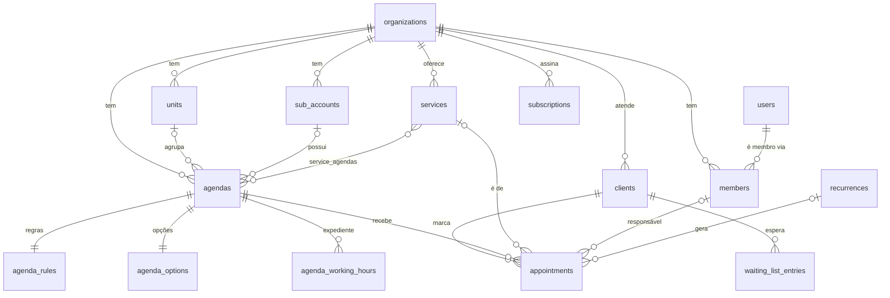

Nos diagramas das áreas 2 a 9, a ligação de cada tabela com `organizations` (pelo
`organization_id`) não é desenhada, para não poluir. A coluna aparece marcada como `FK`.
Tabelas de outras áreas aparecem só com o `id`.

## Diagramas por área

### 1. Organizações, usuários e equipe

A organização é o inquilino: quase toda tabela aponta para ela. `users` é quem faz login; `members` é o vínculo de um usuário com uma organização, com perfil e permissões.

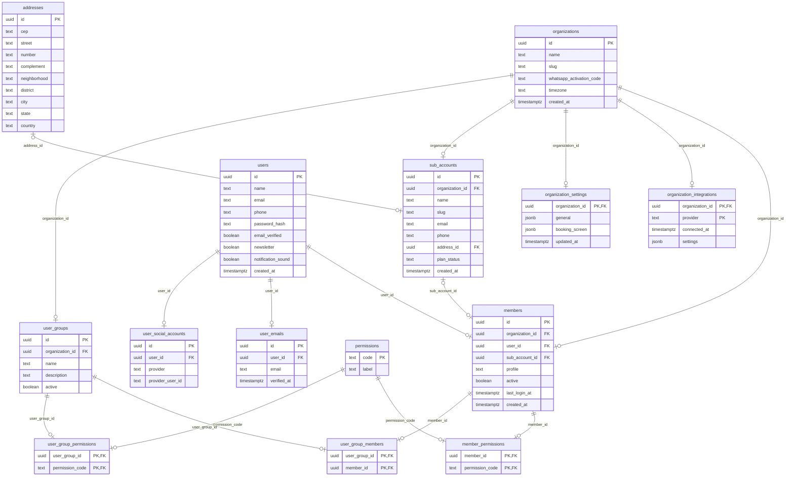

### 2. Agendas, unidades, serviços e tags

A agenda é o centro da configuração. `agenda_rules` e `agenda_options` são 1:1 com ela e guardam os passos do assistente de configuração.

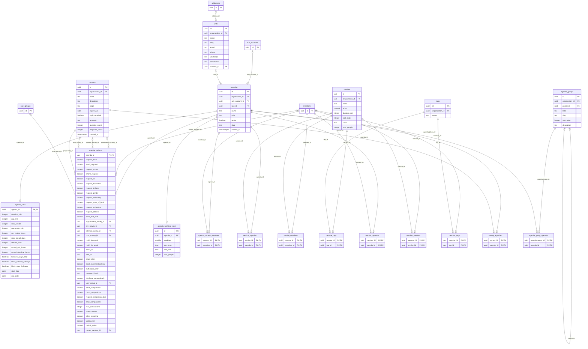

### 3. Disponibilidade

O que abre e fecha horários além do expediente da agenda: bloqueios, ajustes de um horário só, horários manuais e feriados.

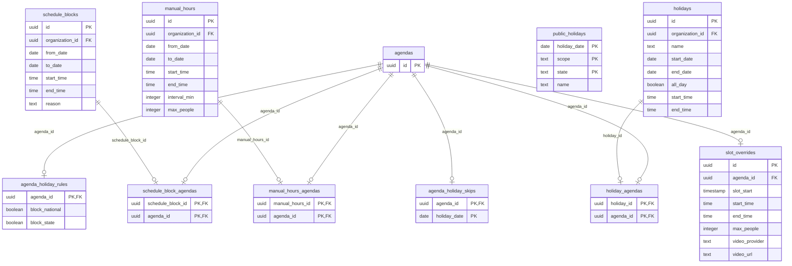

### 4. Clientes e agendamentos


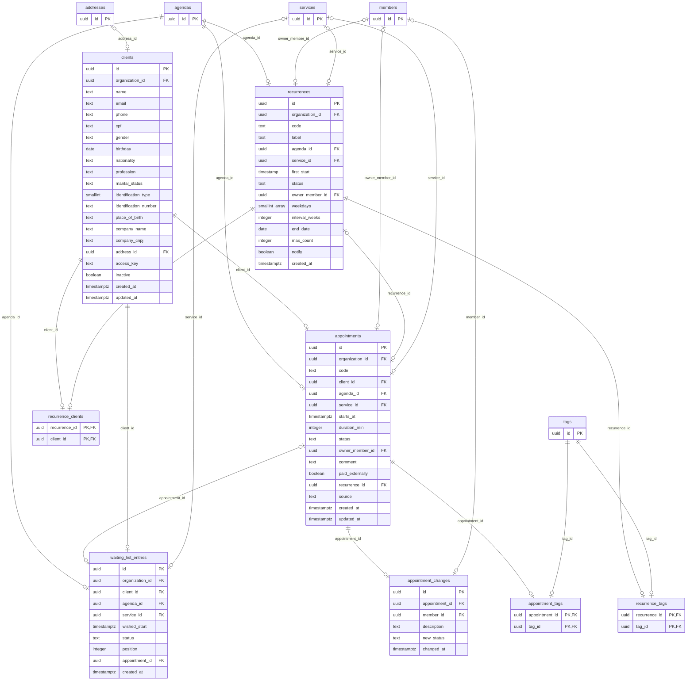

### 5. Regras de acesso

Quem pode agendar e quanto: limites por cliente, contatos bloqueados e listas de acesso.

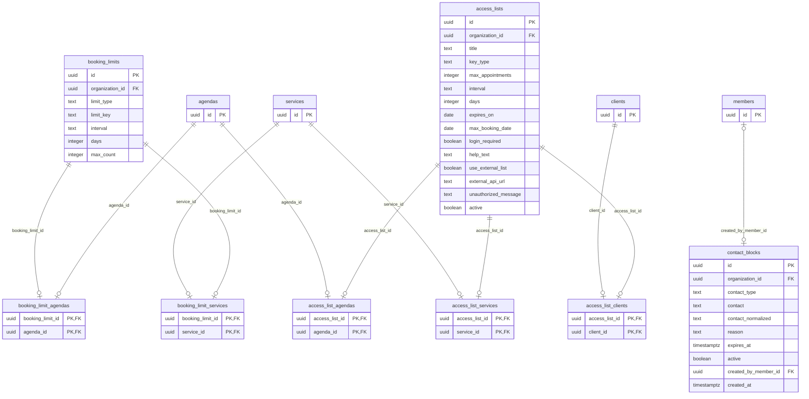

### 6. Comunicação

Modelos, as duas famílias de regras de notificação, os envios e a caixa de entrada do sino.

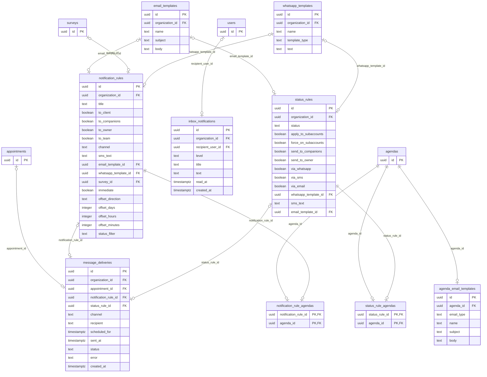

### 7. Convites de cadastro


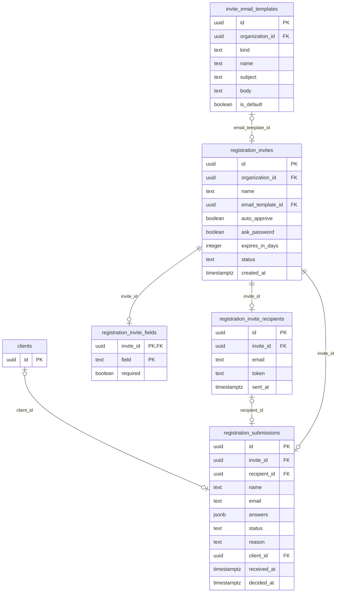

### 8. Plano, créditos e cobrança

`plans`, `plan_prices` e `plan_addons` são catálogo, iguais para todas as organizações.

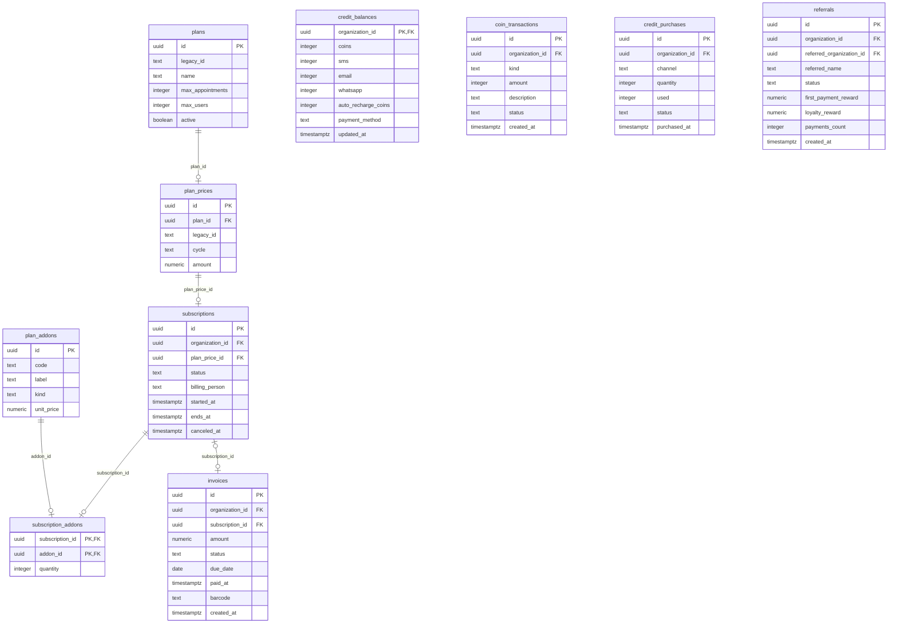

### 9. Suporte e históricos


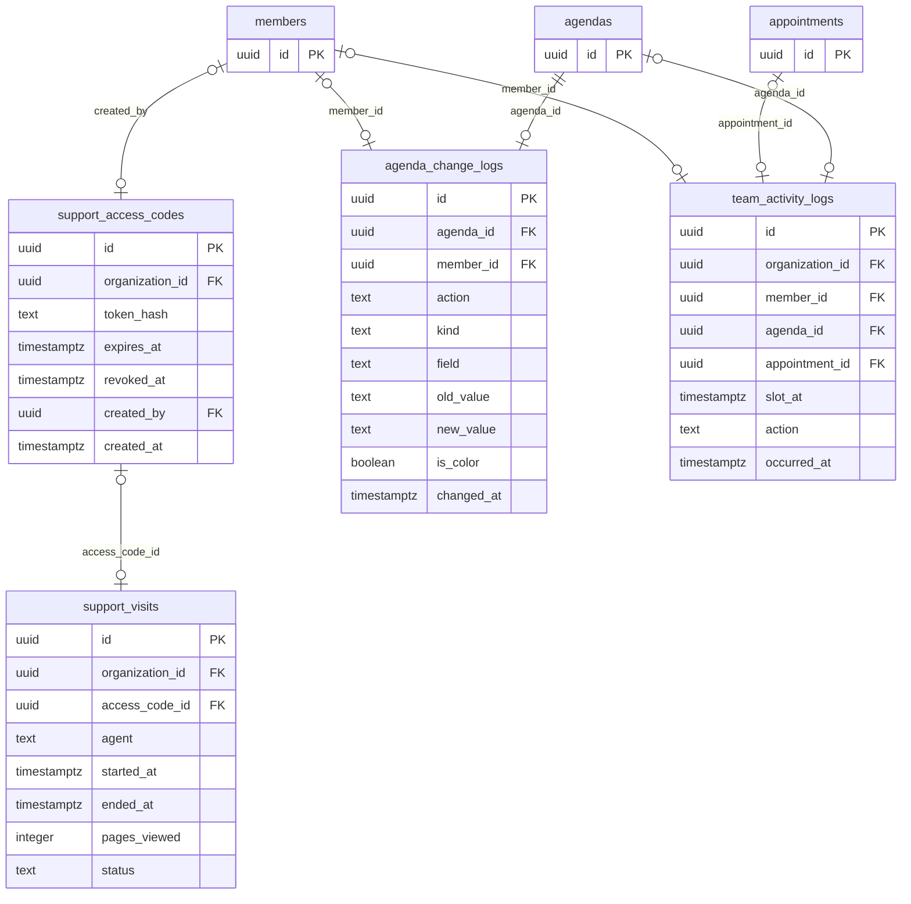


### 10. Webhooks, domínios e importação de clientes

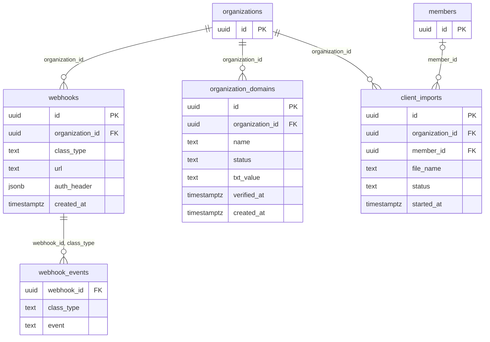

`webhook_events` repete `class_type` de propósito. A tela só oferece cada evento para certos
tipos de registro — não existe cancelamento de agenda nem exclusão de agendamento — e essa regra
só pode virar um CHECK se a coluna estiver na mesma linha do evento. A chave estrangeira composta
contra `webhooks (id, class_type)` impede que as duas divirjam.
